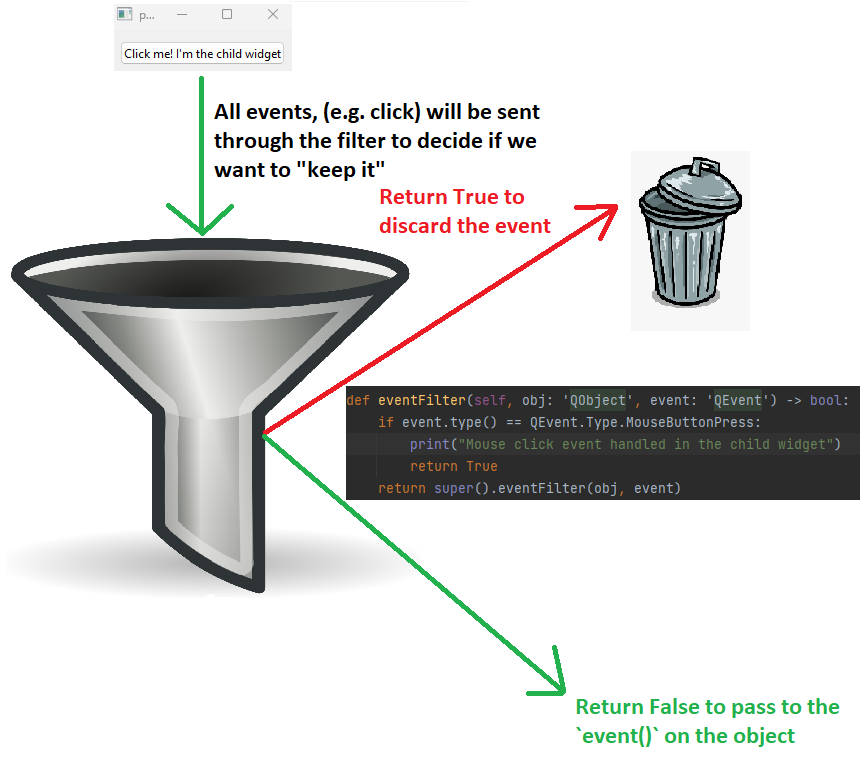

# `eventFilter`

We are going to begin our study of Qt events by first learning about an event filter in Qt. Any `QObject` can implement it's on `eventFilter` method which can then be installed onto another `QObject` using `installEventFilter`. Typically, it *monitors* the events of another object.



The code below is used to create the above picture,

```Python
import sys
from PyQt6.QtWidgets import QApplication, QFrame, QVBoxLayout, QPushButton
from PyQt6.QtCore import QEvent, QObject


class ChildWidgetEventFilter(QObject):

    def eventFilter(self, obj: 'QObject', event: 'QEvent') -> bool:
        if event.type() == QEvent.Type.MouseButtonPress:
            print("Mouse click event handled in the child widget")
            return True
        return super().eventFilter(obj, event)


class ChildWidget(QPushButton):

    def __init__(self, *args):
        super().__init__(*args)
        """
        We need to set our event filter to a variable or it will be garbage collected when we leave
        scope, i.e. self.installEventFilter(ChildWidgetEventFilter()) will not work.
        """
        self._event_filter = ChildWidgetEventFilter()
        self.installEventFilter(self._event_filter)

    def mousePressEvent(self, event):
        print("Inside mouse press event on Child")


class ParentWidget(QFrame):
    pass


app = QApplication(sys.argv)
main_window = ParentWidget()

child_widget = ChildWidget("Click me! I'm the child widget")

layout = QVBoxLayout()
layout.addWidget(child_widget)

main_window.setLayout(layout)

main_window.show()
sys.exit(app.exec())
```

In this example, `ChildWidgetEventFilter` is our `QObject` which implements `eventFilter`. This is then installed onto our `QPushButton` via `self.installEventFilter(self._event_filter)`. Therefore any events for our button will first go through the `eventFilter` method on `ChildWidgetEventFilter`.

Hence in this example when I click the button, it will first go into the `eventFilter`. It will then call the `print` statement. In this example I return `True` so the event will not be passed to the `mousePressEvent` method. Modifying the code to instead be,

```Python
if event.type() == QEvent.Type.MouseButtonPress:
    print("Mouse click event handled in the child widget")
    return False
```

Will **NOT** filter out the event and hence `mousePressEvent` will be called.


# Event Propagation

Event propogation is important to understand. By default, events will main isolated to the widget that was clicked. As an example when we click the button an event first be passed to `eventFilter` and if we return `False` will be will passed to the objects appropiate function, for a click event it will be passed to `mousePressEvent`. If we return `True` it will be consumed and binned.

If we want to propogate the event from the child to the parent we need to call the [ignore](https://doc.qt.io/qt-6/qevent.html#ignore) method on the `QEvent`. By calling `event.ignore()` it will propogate the event from the child to the parent. This is useful with when a widget is a combination of many, where we click a widget but want to have behaviour for somewhere else.

By altering the previous code I will demonstrate the effect of child to parent event propogation,

```Python
import sys
from PyQt6.QtWidgets import QApplication, QFrame, QVBoxLayout, QPushButton
from PyQt6.QtCore import QEvent, QObject


class ChildWidgetEventFilter(QObject):

    def eventFilter(self, obj: 'QObject', event: 'QEvent') -> bool:
        if event.type() == QEvent.Type.MouseButtonPress:
            print("Mouse click event handled in the child widget")
            event.ignore()
            return True
        return super().eventFilter(obj, event)


class ChildWidget(QPushButton):

    def __init__(self, *args):
        super().__init__(*args)
        """
        We need to set our event filter to a variable or it will be garbage collected when we leave
        scope, i.e. self.installEventFilter(ChildWidgetEventFilter()) will not work.
        """
        self._event_filter = ChildWidgetEventFilter()
        self.installEventFilter(self._event_filter)

    def mousePressEvent(self, event):
        print("Inside mouse press event on Child")


class ParentWidget(QFrame):

    def mousePressEvent(self, event) -> None:
        print("Inside ParentWidget mousePressEvent")


app = QApplication(sys.argv)
main_window = ParentWidget()

layout = QVBoxLayout()
layout.addWidget(ChildWidget("Click me! I'm the child widget"))

main_window.setLayout(layout)

main_window.show()
sys.exit(app.exec())

```

In this example by calling `event.ignore()`, it means the event will also be given to the `ParentWidget` `mousePressEvent`. The event propogation will occur even if the child widget returns `True`.

# `event()`

The `event` method is used to handle events for a specific widget directly. It provides a way to handle specific events in a widget subclass without the need to use an event filter. This method is typically used when you want to handle events for a single widget without affecting other widgets' behavior. When you override the `event` method, you should call the base class implementation using `super().event(event)` to ensure proper handling of other events without doing this events such as the `paintEvent` will not be called and the widget will not be rendered.

When performing a click operation on a widget with `event` and an `eventFilter` the event passing order is as follows,

1. `eventFilter`
2. `event()`
3. `mousePressEvent`

When using the code below I install an `eventFilter` and implement an `event()` onto my `QPushButton`. The `eventFilter` will be first determine if the event will be passed to the `QObject`, then the `event()` method will further determine if it will be used.

```Python
import sys
from PyQt6.QtWidgets import QApplication, QFrame, QVBoxLayout, QPushButton
from PyQt6.QtCore import QEvent, QObject


class ChildWidgetEventFilter(QObject):

    def eventFilter(self, obj: 'QObject', event: 'QEvent') -> bool:
        if event.type() == QEvent.Type.MouseButtonPress:
            print("ChildWidgetEventFilter: eventFilter")
            return False
        return super().eventFilter(obj, event)


class ChildWidget(QPushButton):

    def __init__(self, *args):
        super().__init__(*args)
        """
        We need to set our event filter to a variable or it will be garbage collected when we leave
        scope, i.e. self.installEventFilter(ChildWidgetEventFilter()) will not work.
        """
        self._event_filter = ChildWidgetEventFilter()
        self.installEventFilter(self._event_filter)

    def event(self, event: QEvent) -> bool:
        if event.type() == QEvent.Type.MouseButtonPress:
            print("ChildWidget: event")
            return False
        return super().event(event)

    def mousePressEvent(self, event):
        print("ChildWidget: mousePressEvent")


class ParentWidget(QFrame):

    def mousePressEvent(self, event) -> None:
        print("Inside ParentWidget mousePressEvent")


app = QApplication(sys.argv)
main_window = ParentWidget()

layout = QVBoxLayout()
layout.addWidget(ChildWidget("Click me! I'm the child widget"))

main_window.setLayout(layout)

main_window.show()
sys.exit(app.exec())

```